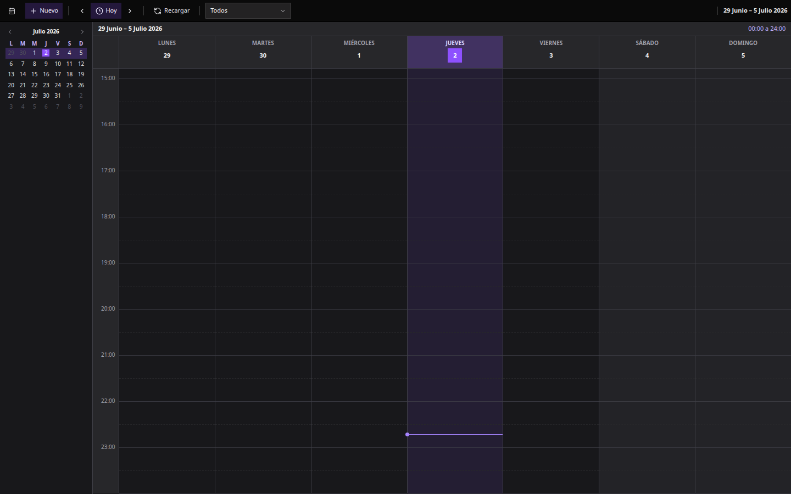
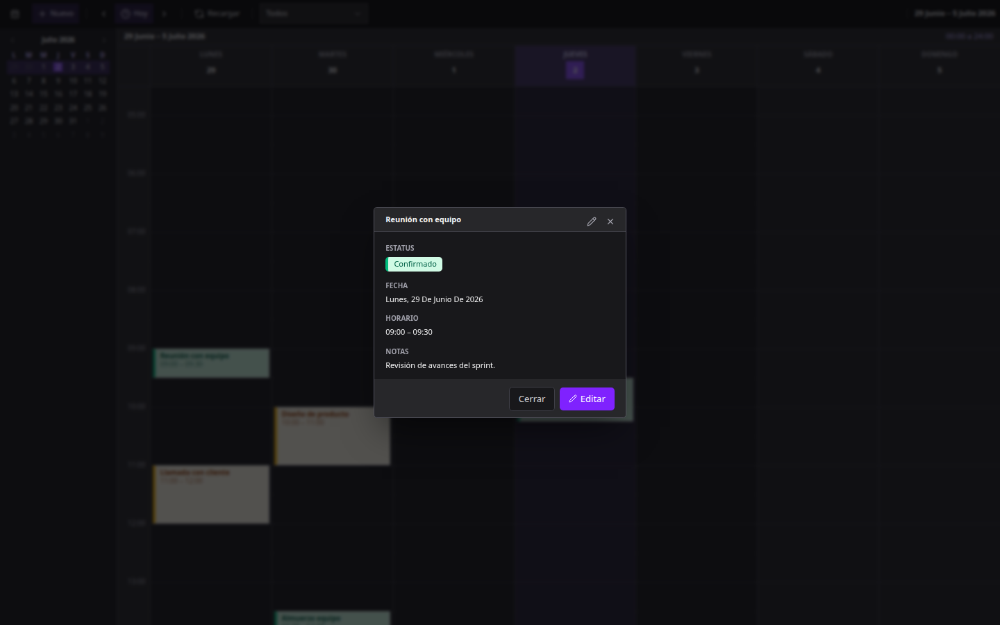
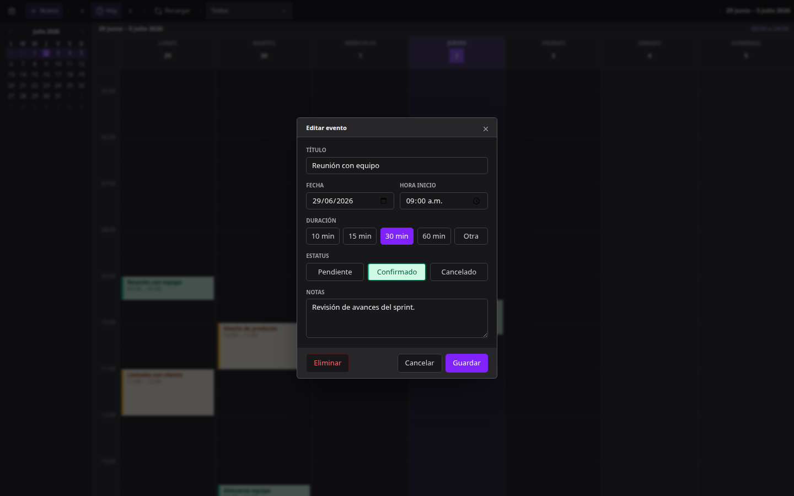

# Agenda

Una agenda semanal para organizar citas y eventos, con una interfaz clara tipo calendario. Pensada para verse y usarse bien tanto en computadora como en el celular.

## ¿Qué puedes hacer?

- **Ver tu semana de un vistazo**, con los eventos ubicados por hora en una grilla.
- **Crear un evento** tocando directamente el horario deseado, o desde el botón "Nuevo".
- **Consultar el detalle de un evento** con un clic, sin entrar directo a editar.
- **Editar o eliminar** un evento desde esa misma vista, con un solo botón.
- **Marcar el estatus** de cada evento: pendiente, confirmado o cancelado, cada uno con su propio color.
- **Filtrar** qué estatus quieres ver en el calendario.
- **Moverte entre semanas** o saltar directo a "Hoy".
- **Usarla desde el celular**: en pantallas pequeñas la vista cambia a un día a la vez, deslizable con el dedo, y el calendario mensual se abre como un panel lateral.

## Cómo se ve

La app usa un tema oscuro, con una barra de herramientas superior para las acciones principales y un panel lateral con el mini-calendario para saltar rápido entre fechas.

Al hacer clic en un evento se abre primero su detalle, sin entrar directo a modo edición:

Desde ahí, un solo botón lleva al formulario de edición:

En el celular, esa misma información se reorganiza: la vista pasa a un día a la vez, deslizable con el dedo, y los detalles y formularios aparecen como paneles que suben desde abajo, en lugar de ventanas flotantes — el patrón que ya conoces de la mayoría de apps móviles.

## Estado del proyecto

Esta es una versión de demostración: los datos se guardan en el propio navegador (no hay un servidor detrás todavía). Sirve para probar el flujo completo de la aplicación y como base para una futura versión con una base de datos real, cuentas de usuario y notificaciones por correo.

## Stack técnico

React + TypeScript, con Tailwind CSS para los estilos y Vite como herramienta de desarrollo.
